# Gestion de Centre de Formation

Une solution web complète et moderne pour la gestion administrative et pédagogique d'un centre de formation, développée avec Laravel 11 et Bootstrap 5.

---

### Authentification & Inscription Initiale
L'accès au portail est sécurisé par un système de rôles. Les nouveaux étudiants peuvent créer un compte et choisir leur première formation directement.

| Page de Connexion | Inscription Initiale |
| :---: | :---: |
|  | 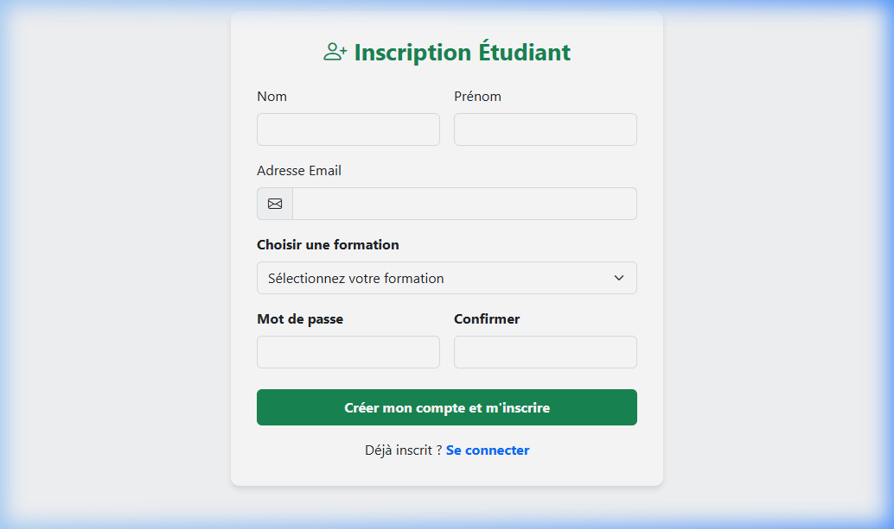 |
| *Accès sécurisé pour Admin, Formateurs et Étudiants.* | *Formulaire d'accueil pour les nouveaux étudiants.* |

---
### Espace Administrateur (Gestion Centrale)
L'administrateur supervise l'intégralité du centre, des inscriptions aux finances.

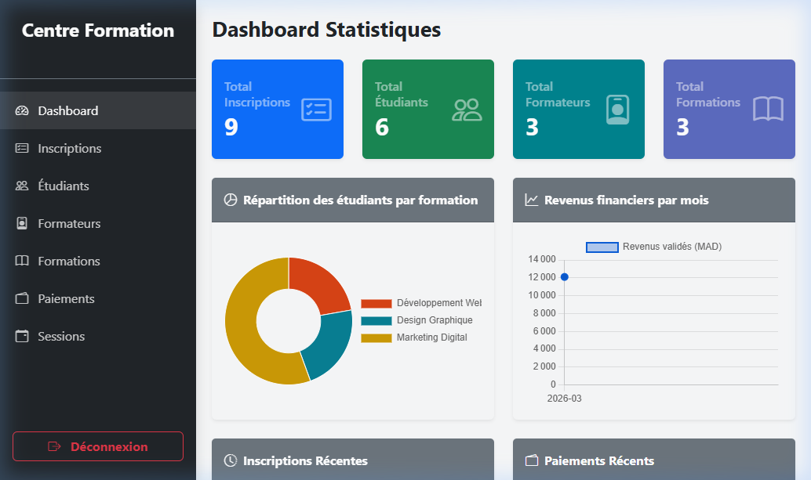
*Vue globale avec statistiques de fréquentation, répartition par formation et graphes de revenus mensuels.*

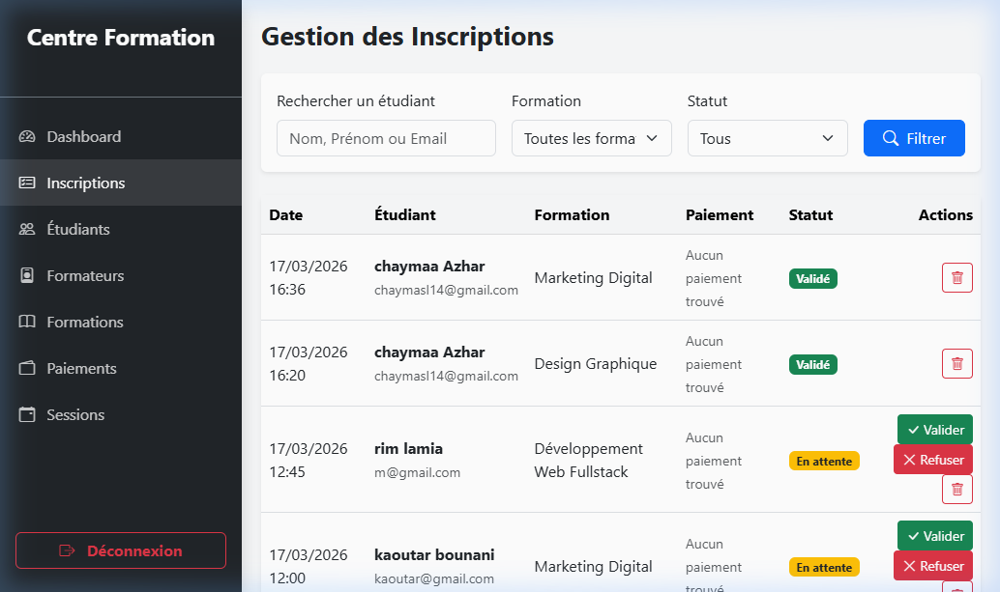
*Validation ou refus des demandes d'inscriptions entrantes avec gestion automatisée des places.*

| Gestion Formateurs | Gestion Étudiants |
| :---: | :---: |
| 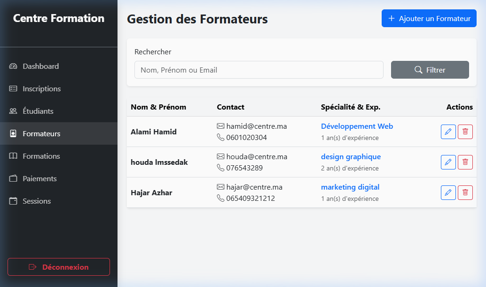 | 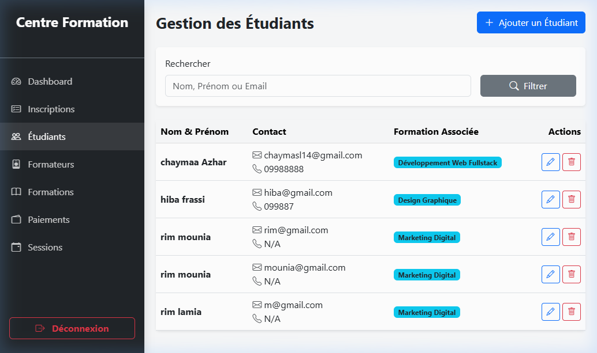 |
| *Gestion du personnel enseignant et de leurs spécialités.* | *Liste des étudiants inscrits avec filtres de recherche.* |

| Gestion Paiements | Gestion Sessions |
| :---: | :---: |
| 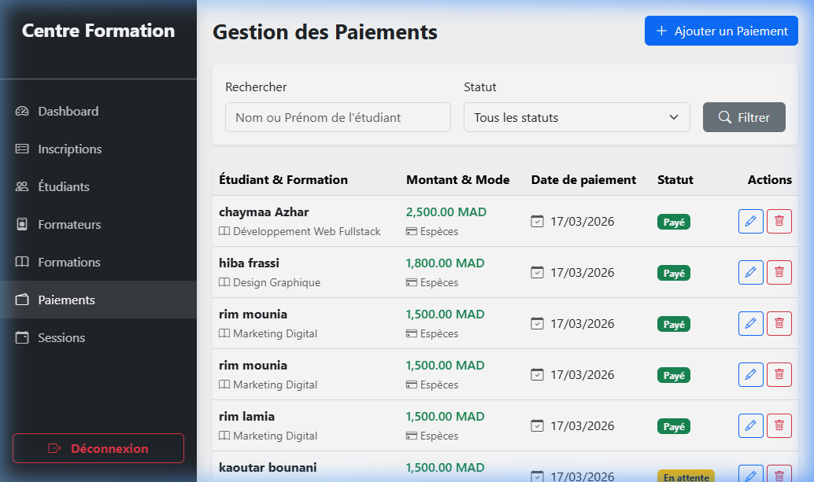 | 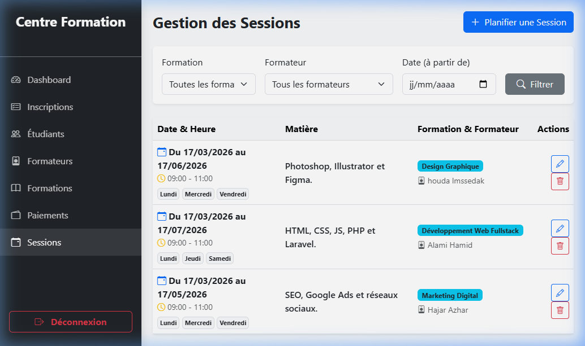 |
| *Suivi comptable de toutes les transactions du centre.* | *Planification des cours (matières, horaires, jours de la semaine).* |

---

### Espace Étudiant (Suivi & Nouvelles Inscriptions)
Une fois connecté, l'étudiant dispose d'un tableau de bord complet pour suivre ses cours, ses notes et ses paiements. Il peut également s'inscrire à de nouvelles formations supplémentaires.

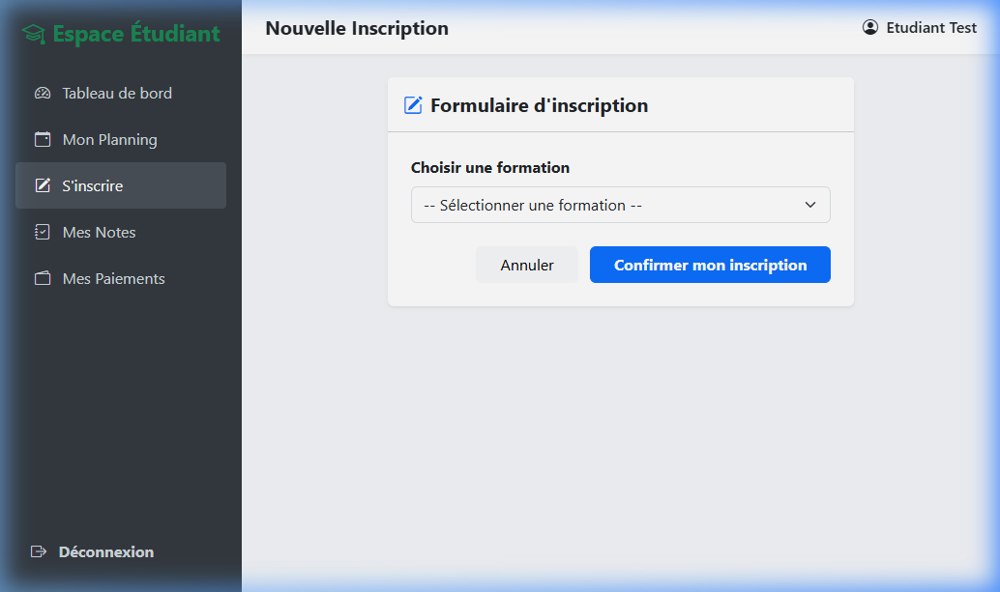
*Interface interne permettant à un étudiant déjà inscrit de postuler à d'autres formations du catalogue.*

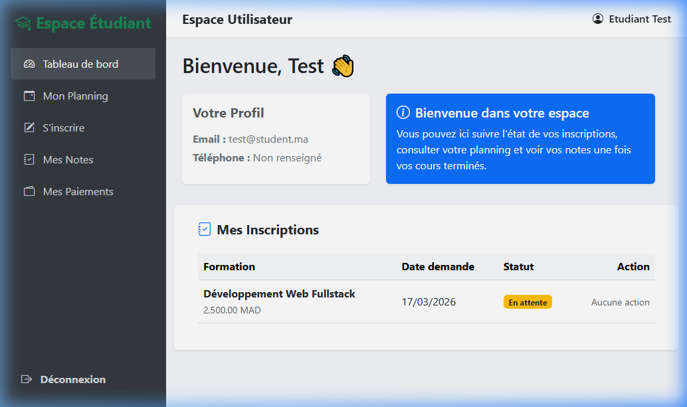
*Résumé du profil, état des inscriptions (En attente/Validé) et accès rapide aux services.*

| Mon Planning | Mes Notes |
| :---: | :---: |
| 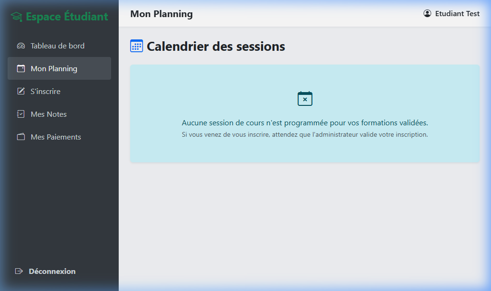 | 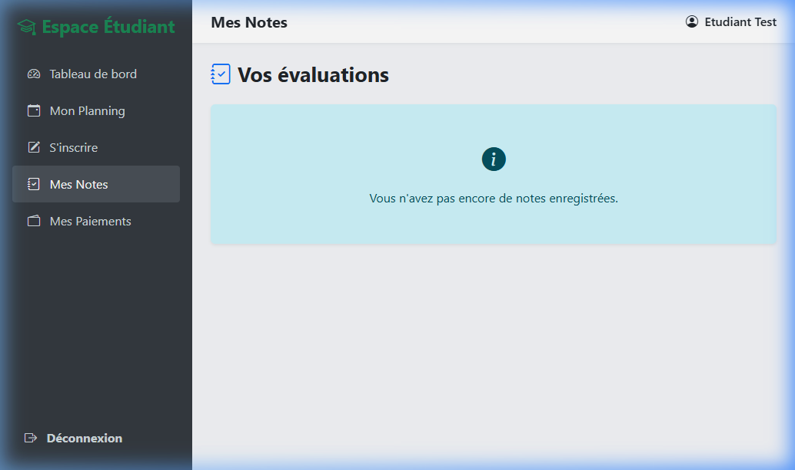 |
| *Calendrier unifié affichant les sessions de toutes les formations validées.* | *Relevé de notes détaillé avec calcul automatique de la moyenne par formation.* |

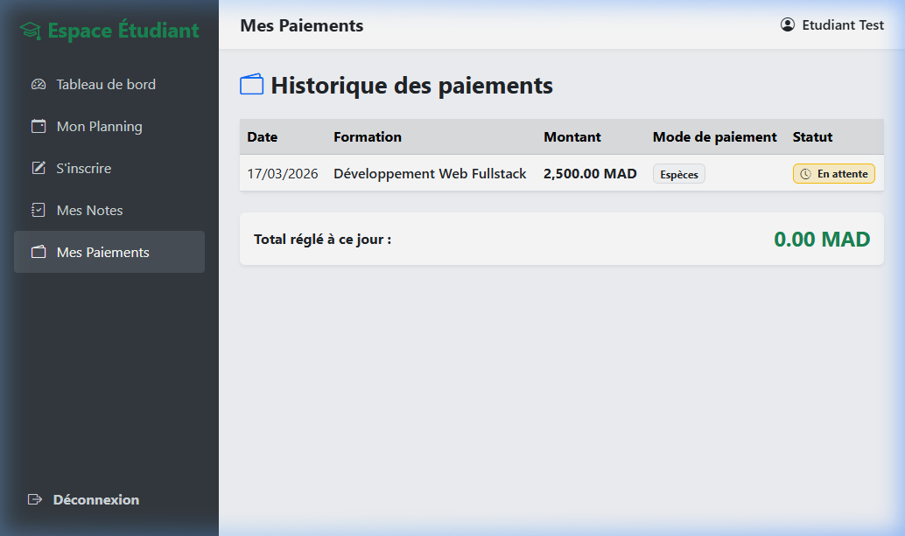
*Historique complet des transactions financières et suivi du solde restant.*

---

### Espace Formateur (Pédagogie)
Le formateur gère ses classes, ses plannings de cours et l'évaluation de ses étudiants.

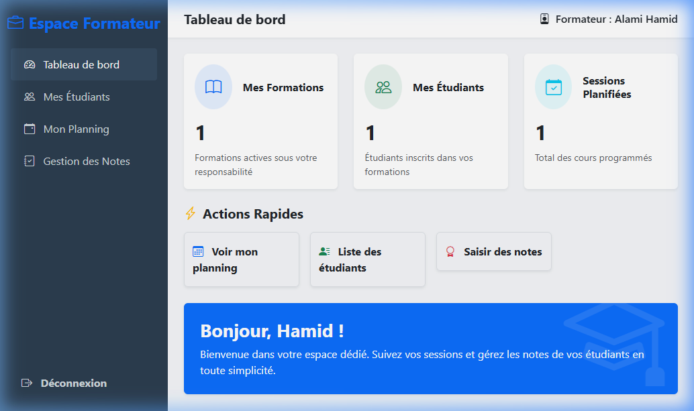
*Aperçu des formations assignées et des statistiques de ses classes.*

| Liste des Étudiants | Saisie des Notes |
| :---: | :---: |
| 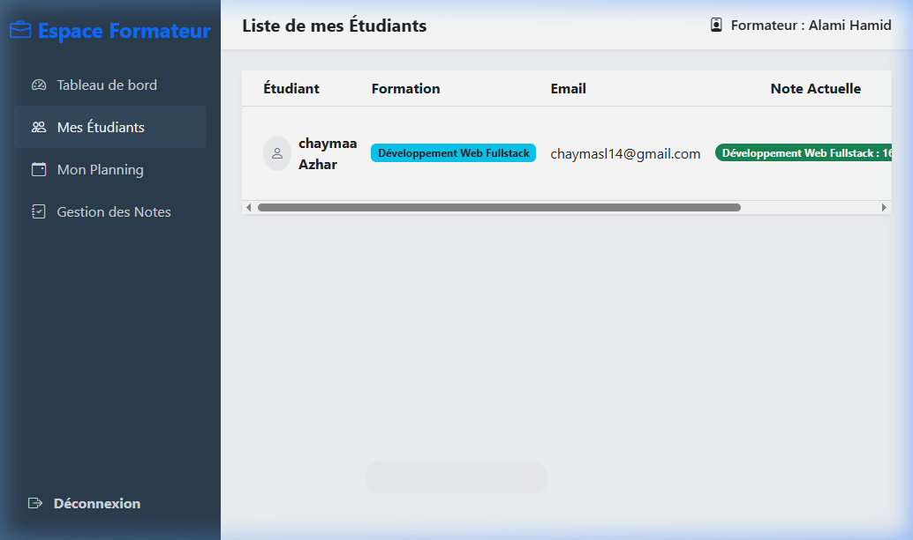 | 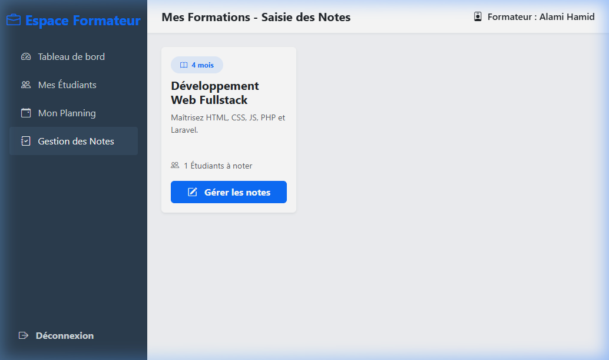 |
| *Visualisation des étudiants validés pour chaque formation.* | *Interface rapide pour l'attribution des notes de fin de module.* |

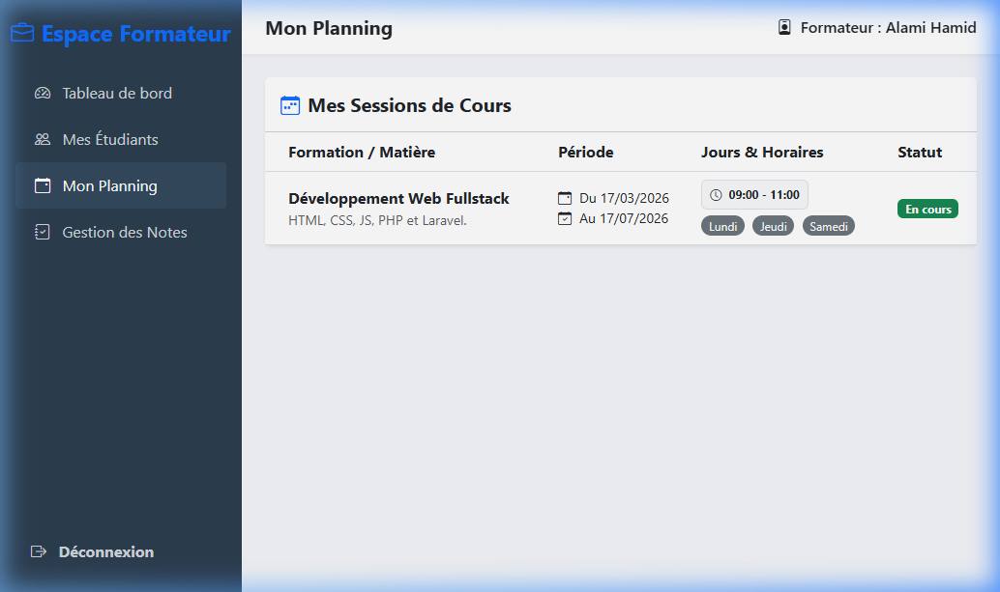
*Calendrier personnel indiquant les créneaux horaires de ses interventions.*

---

## Identifiants de Test (Mode Démo)

| Rôle | Email | Mot de passe |
| :--- | :--- | :--- |
| **Admin** | `admin@centre.ma` | `admin123` |
| **Formateur** | `hamid@centre.ma` | `Hamid123` |
| **Étudiant** | *S'inscrire via le formulaire* | *Votre mot de passe* |

---

## Fonctionnalités Clés

- **Multi-Rôles** : Accès sécurisés pour Administrateurs, Formateurs et Étudiants.
- **Gestion des Places** : Système automatique de quotas (décrémentation à l'inscription, libération au refus).
- **Planning Dynamique** : Gestion des sessions de cours avec jours de la semaine et statuts automatiques (À venir, En cours, Terminé).
- **Système de Notation** : Les formateurs saisissent les notes, les étudiants les consultent avec calcul de moyenne.
- **Suivi des Paiements** : Enregistrement et historique des transactions pour chaque inscription.
- **Interface Premium** : Design responsive, sombre et élégant avec une expérience utilisateur fluide.

---

## Installation

1. **Cloner le dépôt** :
   ```bash
   git clone <repository-url>
   cd centre-formation
   ```

2. **Installer les dépendances** :
   ```bash
   composer install
   npm install && npm run build
   ```

3. **Configuration de l'environnement** :
   - Copier `.env.example` en `.env`
   - Configurer votre base de données dans le fichier `.env`
   - Générer la clé d'application :
     ```bash
     php artisan key:generate
     ```

4. **Migration et Seeders** :
   ```bash
   php artisan migrate:fresh --seed
   ```

5. **Lancer le serveur** :
   ```bash
   php artisan serve
   ```

---

Développé dans le cadre d'un projet de stage.
